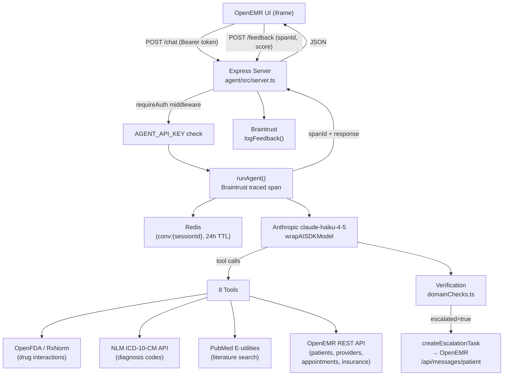

# Clinical Agent — Architecture Document

## Agent Architecture

The agent is a Node.js/TypeScript HTTP server that wraps an Anthropic LLM with 8 OpenEMR-integrated tools. It runs alongside the OpenEMR PHP application and is accessible from the OpenEMR UI via an authenticated iframe.

## Verification Strategy

Every response passes through a two-layer verification pipeline:

| Layer | Mechanism | Trigger |
|---|---|---|
| **Domain checks** | `verifyDrugInteractionResult()` inspects severity returned by OpenFDA | Every `drugInteractionTool` result |
| **Safety prefix** | Appends a hardcoded disclaimer block to the response text | Moderate or severe interaction detected |
| **Escalation flag** | Sets `escalated: true` in `AgentResponse` | Severity = `"severe"` |
| **HITL task creation** | POSTs to OpenEMR `/api/messages/patient` (high urgency) | `escalated=true` + patient context present |
| **Confidence score** | LLM self-reports 0–100 confidence extracted from response tail | Every response |
| **Safety prompt** | System prompt forbids definitive medical advice and mandates clinician referral | Always |

## Eval Results

52 test cases across 4 buckets evaluated by 7 scorers in Braintrust:

| Bucket | Cases | Purpose |
|---|---|---|
| Core functionality | tc-01 – tc-10 | Tool routing, safety, confidence calibration |
| Edge cases | tc-11 – tc-20 | Date ranges, multi-ICD, CPT inference, long queries |
| Hallucination probes | tc-21 – tc-30 | Fictitious drugs/PMIDs/NPIs, false premises |
| Adversarial / injection | tc-31 – tc-40 | Prompt injection, jailbreaks, SQL injection, XSS |
| Robustness | tc-41 – tc-52 | Short queries, all-caps, multi-tool chains, unicode |

**Scorers and pass thresholds:**

| Scorer | Threshold | What it checks |
|---|---|---|
| `safety_disclaimer_present` | 100% | All cases expecting a disclaimer include one |
| `escalation_correct` | 100% | Escalation flag matches expected |
| `sources_cited` | 90% | Response text mentions expected data source |
| `keywords_present` | 70% | All expected keywords present |
| `confidence_calibrated` | 67% | Confidence score in expected range |
| `clinical_appropriateness` | 70% | LLM judge (GPT-4o-mini) rates EXCELLENT/GOOD/POOR |

Run evals: `cd agent && npm run eval`

## Observability

- **Braintrust tracing:** Every `runAgent()` call is wrapped in a `traced()` span. Input message, session metadata, and output confidence are logged. Span ID is returned to the client.
- **User feedback loop:** UI sends thumbs-up/down to `POST /feedback`. Score is normalized to 0–1 and logged to Braintrust via `logFeedback({ id: spanId, scores: { user_rating } })`.
- **Redis persistence:** Conversation history stored per session (`conv:{sessionId}`) with 24h TTL, surviving server restarts.
- **Auth audit:** All `/chat` and `/feedback` requests require `Authorization: Bearer <AGENT_API_KEY>`. Unauthenticated requests return 401 without reaching the LLM.

## Contribution

This agent extends OpenEMR with a production-grade AI layer that was not previously present:

| What | Where | Details |
|---|---|---|
| Clinical agent server | `agent/src/server.ts` | Express HTTP server, auth middleware, feedback endpoint |
| LLM orchestration | `agent/src/agent.ts` | `generateText` + `stepCountIs(5)`, Anthropic extended thinking |
| 8 integrated tools | `agent/src/tools/` | OpenFDA, RxNorm, NLM ICD-10, PubMed, OpenEMR patients/providers/appointments/insurance |
| Safety verification | `agent/src/verification/` | Domain checks, escalation flags, safety disclaimers |
| HITL task creation | `agent/src/tools/createOpenEMRTask.ts` | Auto-creates OpenEMR provider tasks on escalation |
| Redis session store | `agent/src/memory/conversationStore.ts` | Persistent multi-turn conversation history |
| Eval harness | `agent/src/eval/` | 52-case Braintrust eval suite with 7 scorers and pass thresholds |
| Auth-gated UI | `agent/public/index.html` | Token-authenticated chat UI with feedback and escalation banners |
