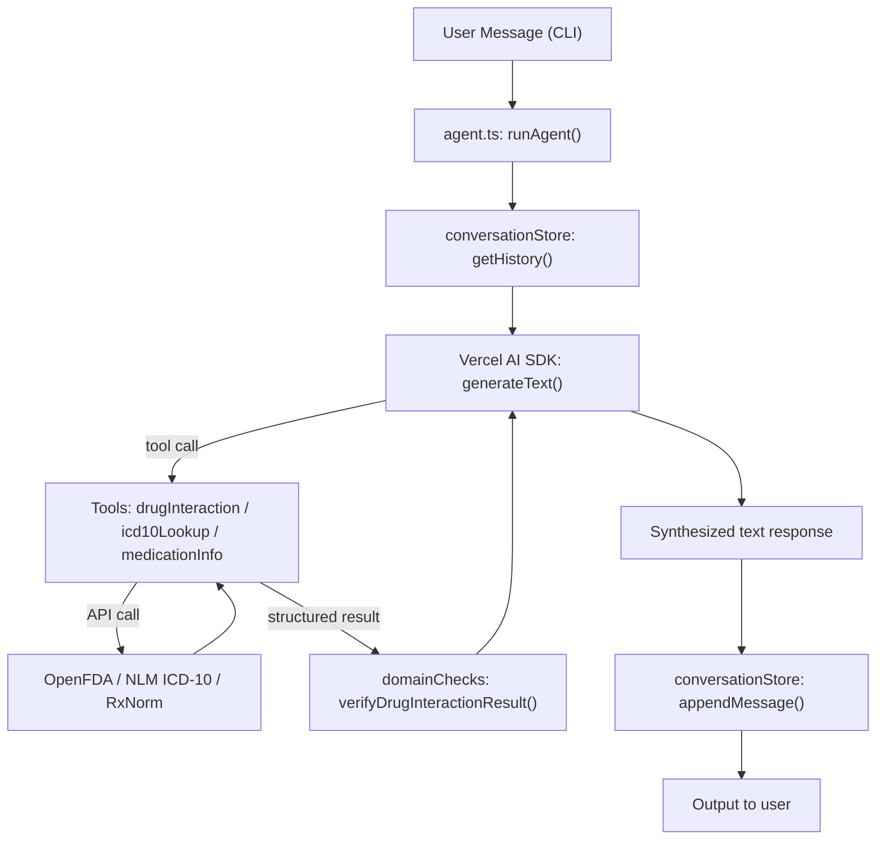

# OpenEMR AI Agent MVP

## What We're Building

A self-contained Node.js/TypeScript project at `agent/` that wires up the Vercel AI SDK to answer clinical natural-language questions using real public medical APIs (OpenFDA, RxNorm, NLM ICD-10).

---

## Directory Layout

```
agent/
  src/
    tools/
      drugInteraction.ts   # OpenFDA drug-drug interaction check
      icd10Lookup.ts       # NLM ICD-10 CM search
      medicationInfo.ts    # RxNorm drug info
    memory/
      conversationStore.ts # In-memory session history (Map<sessionId, CoreMessage[]>)
    verification/
      domainChecks.ts      # Post-tool severity check + confidence scoring
    agent.ts               # generateText loop + tool binding + orchestration
    index.ts               # CLI entry point (readline REPL)
  tests/
    evaluation.test.ts     # 5+ vitest test cases
  package.json
  tsconfig.json
  .env.example
```

---

## Key Dependencies (`agent/package.json`)

- `ai` — Vercel AI SDK core
- `@ai-sdk/openai` — OpenAI provider (routed through your key, model: `gpt-4o-mini`)
- `zod` — Tool input schemas
- `tsx` — Run TypeScript directly
- `vitest` — Test runner

---

## The 3 Tools

### 1. `drugInteractionTool` (`agent/src/tools/drugInteraction.ts`)

- Input: `{ drug1: string, drug2: string }`
- API: `https://api.fda.gov/drug/label.json?search=openfda.generic_name:{drug}&limit=1`
- Returns: `{ drug1, drug2, interactions: string[], severity: "none"|"mild"|"moderate"|"severe", source: "OpenFDA" }`

### 2. `icd10LookupTool` (`agent/src/tools/icd10Lookup.ts`)

- Input: `{ query: string, maxResults?: number }`
- API: `https://clinicaltables.nlm.nih.gov/api/icd10cm/v3/search?sf=code,name&terms={query}`
- Returns: `{ results: Array<{ code: string, description: string }>, total: number, source: "NLM ICD-10-CM" }`

### 3. `medicationInfoTool` (`agent/src/tools/medicationInfo.ts`)

- Input: `{ drugName: string }`
- API: `https://rxnav.nlm.nih.gov/REST/drugs.json?name={drugName}` + `/REST/rxclass/class/byDrugName.json`
- Returns: `{ rxcui: string, name: string, drugClass: string[], dosageForms: string[], source: "RxNorm" }`

---

## Conversation History (`agent/src/memory/conversationStore.ts`)

```typescript
const sessions = new Map<string, CoreMessage[]>();
export function getHistory(sessionId: string): CoreMessage[] { ... }
export function appendMessage(sessionId: string, msg: CoreMessage): void { ... }
export function clearSession(sessionId: string): void { ... }
```

Each `generateText` call passes the full session history so the model has multi-turn context.

---

## Domain Verification (`agent/src/verification/domainChecks.ts`)

One required domain-specific check: **post-drug-interaction severity gate**.

```typescript
export function verifyDrugInteractionResult(result: DrugInteractionResult): VerificationResult {
  // Flags "severe" interactions with an escalation warning
  // Returns { passed: boolean, confidence: number, escalate: boolean, reason?: string }
}
```

The agent checks this before surfacing results — severe interactions get a safety disclaimer injected into the response.

---

## Agent Orchestration (`agent/src/agent.ts`)

```typescript
export async function runAgent(userMessage: string, sessionId: string): Promise<string> {
  const history = getHistory(sessionId);
  const result = await generateText({
    model: openai("gpt-4o-mini"),
    tools: { drugInteractionTool, icd10LookupTool, medicationInfoTool },
    maxSteps: 5,
    messages: [...history, { role: "user", content: userMessage }],
    system: CLINICAL_SYSTEM_PROMPT,
  });
  appendMessage(sessionId, { role: "user", content: userMessage });
  appendMessage(sessionId, { role: "assistant", content: result.text });
  return result.text;
}
```

Errors from tools are caught at the tool level and returned as structured `{ error: string }` objects — the agent synthesizes these gracefully rather than crashing.

---

## Evaluation (`agent/tests/evaluation.test.ts`)

5 test cases using `vitest` + a simple assertion helper that checks the agent's response contains expected keywords/codes:

| # | Input | Expected in output |
|---|-------|--------------------|
| 1 | "What are interactions between warfarin and aspirin?" | "interaction", "bleeding" |
| 2 | "ICD-10 code for essential hypertension" | "I10" |
| 3 | "Tell me about metformin" | "metformin", "diabetes" or "biguanide" |
| 4 | "Is lisinopril safe with ibuprofen?" | "interaction" or "kidney" |
| 5 | "What ICD-10 codes match chest pain?" | "R07" |

Tests call `runAgent()` directly (no HTTP layer needed for eval).

---

## Flow Diagram


