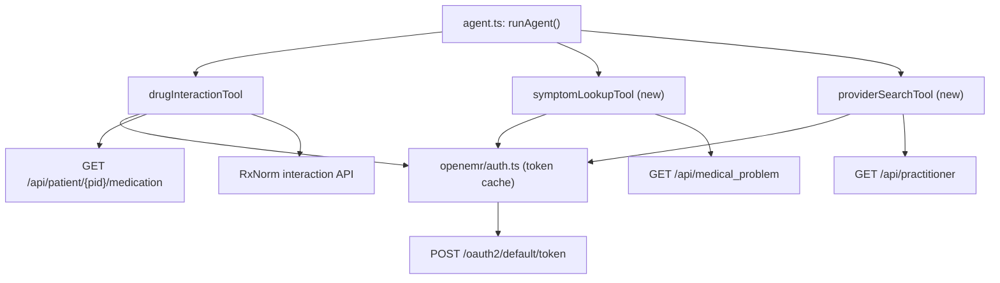

# OpenEMR AI Tool Integration

## Architecture



## Authentication

OpenEMR uses OAuth 2.0 Client Credentials grant for backend services.

- New file: `agent/src/openemr/auth.ts`
  - Calls `POST http://localhost:8300/oauth2/default/token` with `grant_type=client_credentials`
  - Caches the token in-memory until expiry
  - Exports `getOpenEMRToken(): Promise<string>`
- Add to `agent/.env.example`:
  ```
  OPENEMR_BASE_URL=http://localhost:8300
  OPENEMR_CLIENT_ID=
  OPENEMR_CLIENT_SECRET=
  ```
- Register a confidential client in OpenEMR admin at `/interface/smart/register-app.php` with scopes: `system/Patient.rs system/MedicationRequest.rs system/Condition.rs system/Practitioner.rs`

## Tool 1: drugInteractionTool (enhanced)

File: `agent/src/tools/drugInteraction.ts`

Current behavior: calls OpenFDA by drug name.

Enhanced behavior — two modes:

- **With `patientId`**: fetch the patient's actual medications from `GET /api/patient/{pid}/medication`, extract RxNorm codes, then call RxNorm's interaction API (`https://rxnav.nlm.nih.gov/REST/interaction/list.json?rxcuis={rxcuis}`) — same approach OpenEMR's internal PHP uses in `controllers/C_Prescription.class.php`
- **Without `patientId`**: existing OpenFDA fallback (no change)

Input schema change: add optional `patientId: z.string().optional()`

## Tool 2: symptomLookupTool (new)

New file: `agent/src/tools/symptomLookup.ts`

- Calls `GET /api/medical_problem` (or `/api/patient/{puuid}/medical_problem` when a patient UUID is provided)
- Supports text search by condition title or ICD-10 code via query params
- Returns: `{ results: Array<{ uuid, title, diagnosis, begdate, activity }>, source: "OpenEMR" }`
- Input: `{ query?: string, patientUuid?: string }`
- Replaces the existing `icd10LookupTool` for patient-context queries; `icd10LookupTool` can be kept for pure code lookups

Key endpoint: `GET http://localhost:8300/apis/default/api/medical_problem` (requires `Authorization: Bearer {token}`)

## Tool 3: providerSearchTool (new)

New file: `agent/src/tools/providerSearch.ts`

- Calls `GET /api/practitioner` with search params (`fname`, `lname`, `specialty`, `npi`)
- Returns: `{ providers: Array<{ uuid, fname, lname, specialty, npi, phone, email }>, source: "OpenEMR" }`
- Input: `{ name?: string, specialty?: string, npi?: string }`

Key endpoint: `GET http://localhost:8300/apis/default/api/practitioner` (requires `Authorization: Bearer {token}`)

## Files Changed

- `agent/src/openemr/auth.ts` — new, OAuth2 token helper
- `agent/src/tools/drugInteraction.ts` — add optional patientId + OpenEMR med fetch
- `agent/src/tools/symptomLookup.ts` — new tool
- `agent/src/tools/providerSearch.ts` — new tool
- `agent/src/agent.ts` — register the 2 new tools, update system prompt
- `agent/.env.example` — add 3 new env vars
